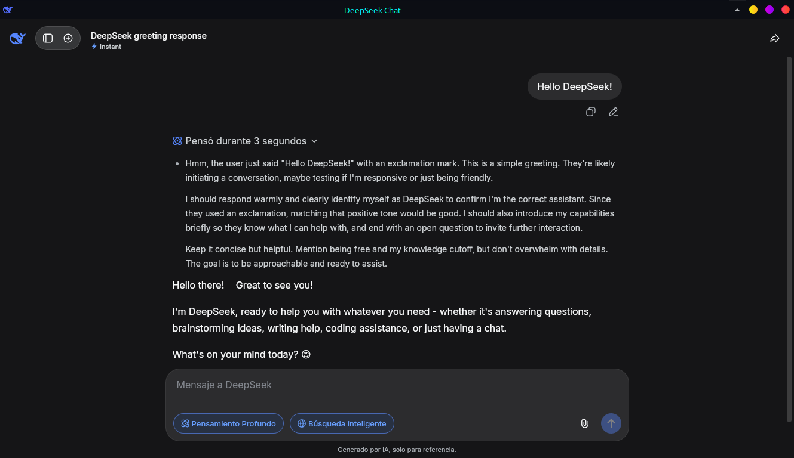

# DeepSeek GTK

[](https://www.gnu.org/licenses/gpl-3.0)
[](https://www.python.org/downloads/)
[](https://www.gtk.org/)
[](https://webkit.org/)

**DeepSeek GTK** is an unofficial, lightweight desktop client for [DeepSeek Chat](https://chat.deepseek.com) written in Python. It uses **GTK3** and **WebKit2** to embed the web interface while providing native features like file downloads, persistent cache, and automatic reconnection.



---

## ✨ Features

- 🌐 **Full DeepSeek Chat experience** – Embedded WebKit view with the official web client.
- 💾 **Persistent data** – Cache, cookies, and local storage are kept between sessions (XDG compliant).
- ⬇️ **Native download manager** – Save files via a standard GTK file chooser, with download progress logging.
- 🔁 **Automatic reconnection** – If the page fails to load, a friendly error dialog appears and the app retries after 10 seconds.
- 🪵 **Logging** – All events (downloads, errors, crashes) are saved to `deepseek.log` inside the app data directory.
- 🎨 **Clean UI** – Native window with customizable size (default 1200x800) and optional application icon.

---

## 📦 Installation

### Requirements

- **Linux** (other OS may work with GTK3 and WebKit2, but not officially tested)
- Python 3.8 or higher
- GTK 3.0 development files
- WebKit2GTK 4.1

### Install dependencies (Ubuntu/Debian)

```bash
sudo apt install python3-gi gir1.2-gtk-3.0 gir1.2-webkit2-4.1
```

### Clone the repository

```bash
git clone https://github.com/diego-joubert/deepseek-gtk.git
cd deepseek-gtk
```

### Easy install (recommended for users)

Execute the installation script:

```bash
chmod +x install.sh
./install.sh
```
>**Soon, the DeepSeek icon should appear in the application menu and you will be able to launch it as a normal program**.

Or just run this:

```bash
python3 -m deepseek
```

---

## 🚀 Usage

Launch the application:

```bash
deepseek-gtk
```

Once open, simply log in or use DeepSeek Chat as you normally would in your browser. Downloads will be intercepted and saved via the native dialog.

### Logs

Logs are stored at:

```
~/.local/share/deepseek-gtk/deepseek.log
```

---

## TODO

- [ ] Add a menu bar with "Clear cache", "Open logs", "About".

---

## 🤝 Contributing

Contributions, bug reports, and feature requests are welcome!  
Feel free to open an issue or a pull request.

---

## 📄 License

This project is licensed under the **GNU Affreno General Public License v3.0** – see the [LICENSE](LICENSE) file for details.

---

## 🙏 Acknowledgements

- Inspired by [Python WhatsApp GTK](https://github.com/laurivaldantas/python-whatsapp-gtk) by Laurival Dantas.
- Built with [PyGObject](https://pygobject.gnome.org/) and [WebKitGTK](https://webkitgtk.org/).
- Thanks to **DeepSeek** for the amazing AI model and chat service.

---

## 👤 Author

**Diego Joubert**  
[GitHub](https://github.com/diego-joubert)

---

**Made with 💜 and Python.**